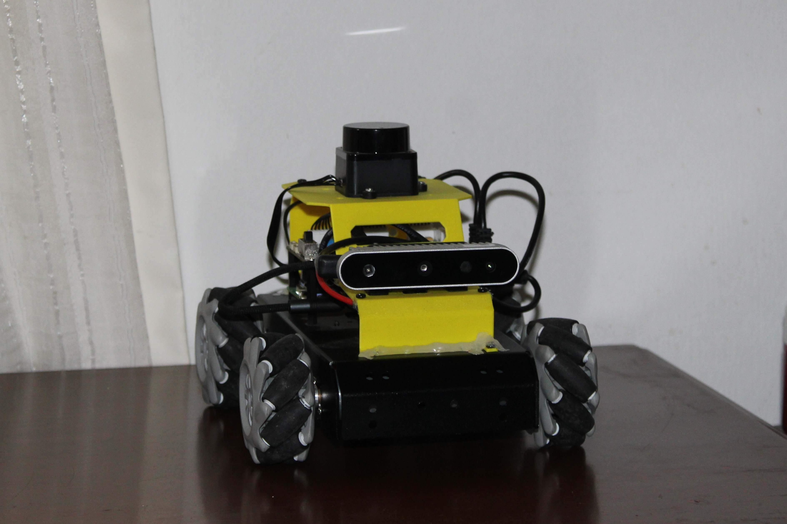
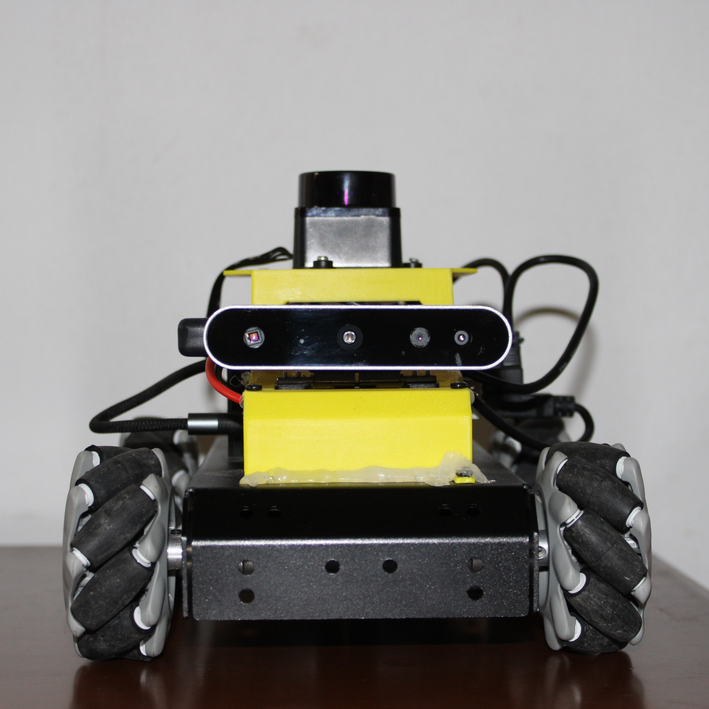
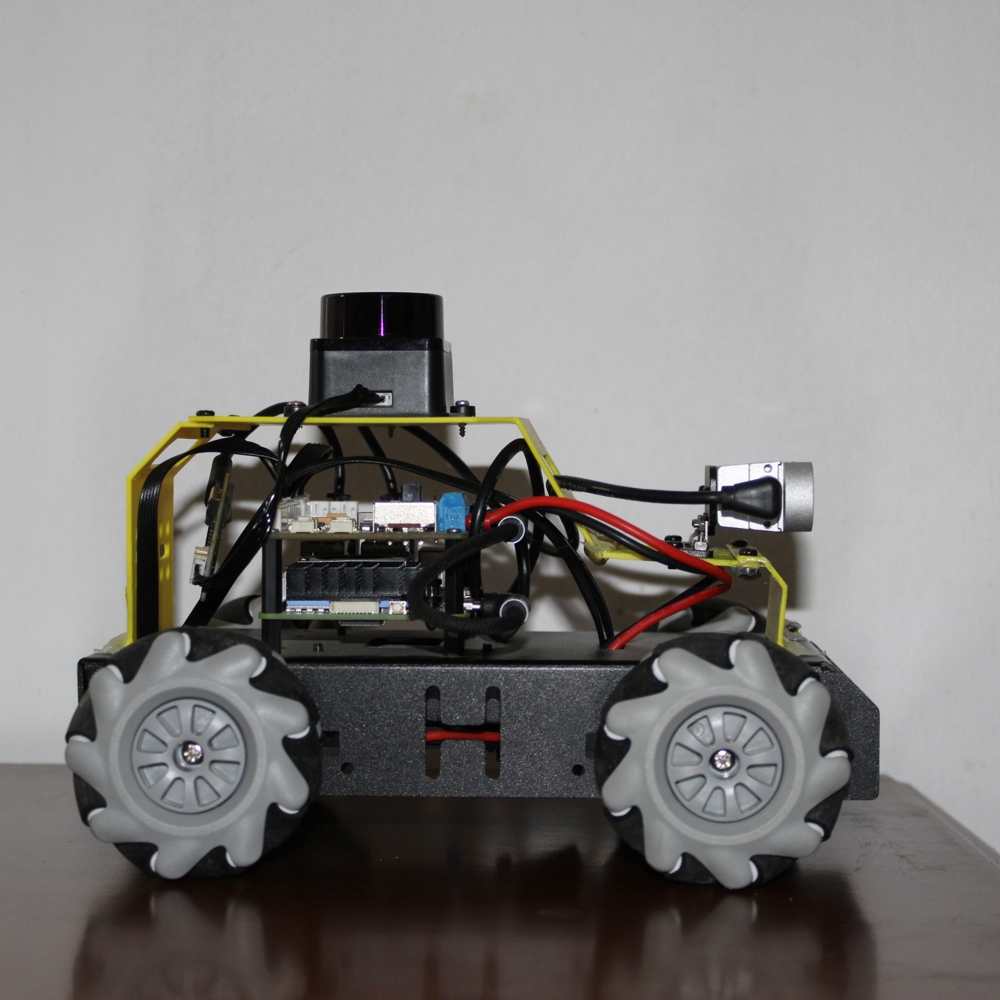
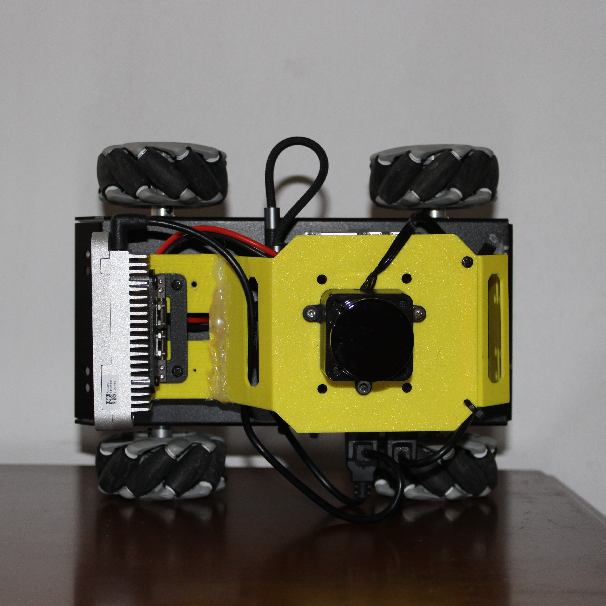
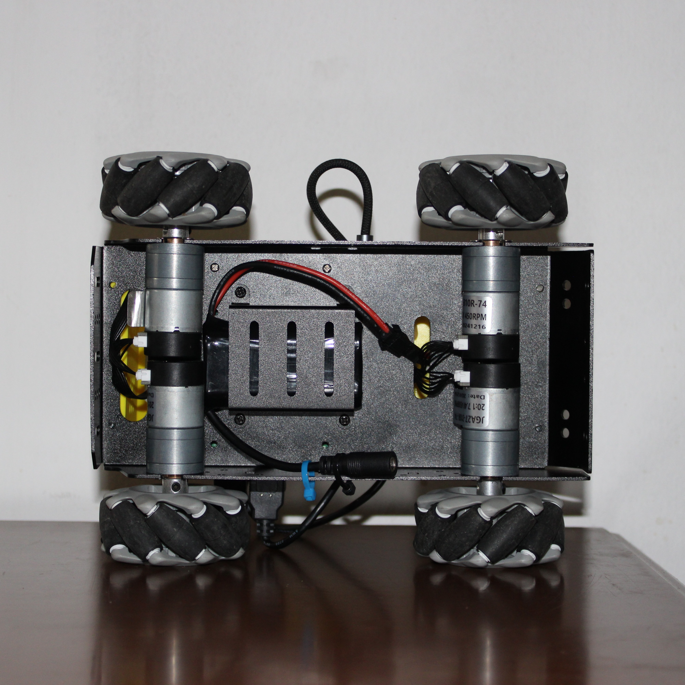
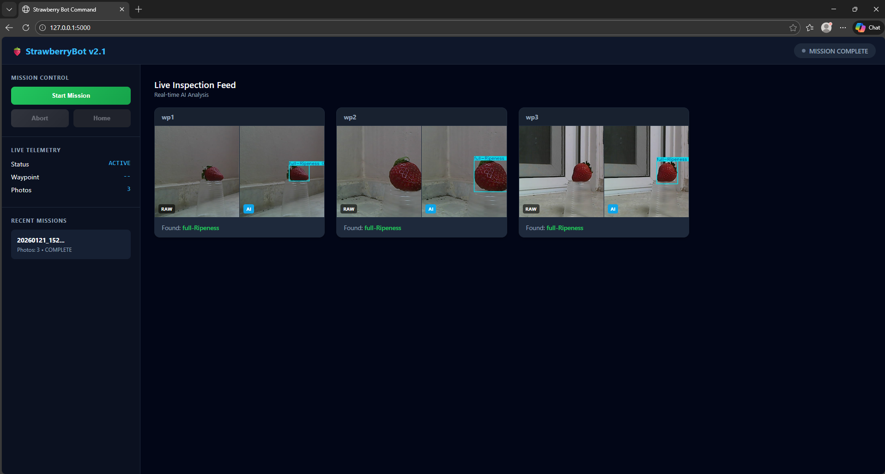
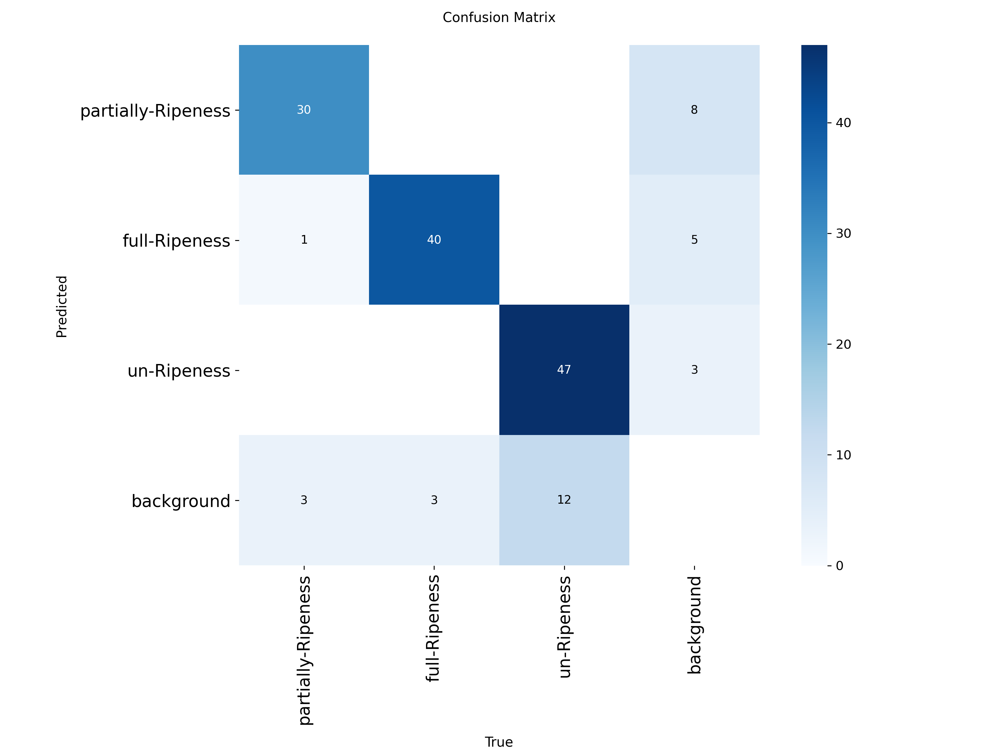
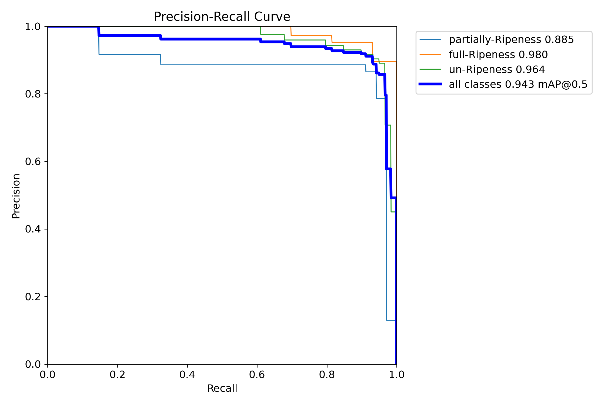

# 🍓 WALSAIP: Autonomous Agricultural Robot


**WALSAIP (Wireless Autonomous Low-cost Smart Agricultural Intelligent Platform)** is an autonomous robotic system designed to support strawberry harvesting operations through navigation, perception, and real-time monitoring. 

Current strawberry harvesting relies heavily on manual labor. The system integrates autonomous mobility, computer vision, and wireless communication into a unified robotic platform suitable for greenhouse and small-scale farm deployment.

---

## 📸 System Gallery & Demonstration

https://github.com/user-attachments/assets/9e9df442-f001-480b-a09a-1c8761bedad1


### Main Platform
<div align="center">
  
</div>

### Hardware Overview
| Front View | Side View | Top View | Undercarriage (Motors) |
| :---: | :---: | :---: | :---: |
|  |  |  |  |

### Software & Interfaces
| Web Dashboard (Live AI Inference) | ROS 2 Nav2 SLAM Mapping (RViz) |
| :---: | :---: |
|  |  |
| *The IoT dashboard showing real-time YOLOv11 strawberry detection.* | *The 2D occupancy grid map generated by the LiDAR and SLAM Toolbox.* |

---

## 🛠️ Hardware Architecture
The platform emphasizes low-cost, modular, and off-the-shelf components:
* **Main Computer:** Raspberry Pi 5 (8 GB RAM) running Raspberry Pi OS.
* **Motor Controller:** RRC Lite Expansion Board for 12.6V voltage regulation and precise closed-loop DC motor control.
* **Navigation Sensor:** STL-19P D500 LiDAR (360-degree DTOF scanner).
* **Vision Sensor:** Hiwonder Aurora930 Pro 3D structured light depth camera.

---

## 🧠 AI Vision System & Performance

The perception system is powered by a custom-trained YOLOv11 deep learning model, designed specifically to detect and classify strawberries into "Ripe" and "Unripe" categories from side-view perspectives. 

While the model utilizes transfer learning from COCO base weights to ensure rapid and stable convergence, it was trained entirely on a **custom-engineered dataset** gathered by the team under varying real-world greenhouse lighting and occlusion conditions. 

### Model Performance Metrics
The model achieves a strong balance between speed and accuracy for edge deployment on the Raspberry Pi 5, reaching an impressive **mAP@0.5 of 94.3%**.

*Note: The graphs below detail the model's high precision and recall capabilities across different confidence thresholds.*

| Confusion Matrix | Normalized Confusion Matrix |
| :---: | :---: |
|  |  |

| F1-Confidence Curve | Precision-Recall Curve |
| :---: | :---: |
|  |  |

| Precision-Confidence Curve | Recall-Confidence Curve |
| :---: | :---: |
|  |  |

## ⚙️ Operations & Deployment Guide

The robot utilizes a split environment: base operations run on the Raspberry Pi host, while the ROS 2 environment is isolated inside a Docker container named `MentorPi`.

### Phase 1: Hardware & Network Setup
Connect to the Raspberry Pi to access the terminal:
* **Option A:** Connect a Mini-HDMI cable to a monitor and use a USB keyboard/mouse.
* **Option B:** Connect an Ethernet cable directly to the internet/router to establish a network connection and add the Wi-Fi password.

### Phase 2: SLAM Mapping (Building the Farm Map)
Run the following commands to map the greenhouse using the LiDAR sensor:
1. `~/.stop_ros.sh stop` *(Stops background ROS processes)*
2. `ros2 launch slam slam.launch.py` *(Starts mapping)*
3. `ros2 launch slam rviz_slam.launch.py` *(Opens RViz visualizer)*
4. `ros2 launch peripherals teleop_key_control.launch.py` *(Allows keyboard driving)*
5. `cd ~/ros2_ws/src/slam/maps && ros2 run nav2_map_server map_saver_cli -f "map_65" --ros-args -p map_subscribe_transient_local:=true` *(Saves the map)*

### Phase 3: Extracting Waypoint Coordinates
To get the exact coordinates for your `waypoints.yaml` file:
1. `ros2 launch navigation navigation.launch.py map:=map_64`
2. `ros2 launch navigation rviz_navigation.launch.py`
3. Use RViz "2D Goal Pose" to point to target locations.
4. `ros2 topic echo /amcl_pose --once` *(Finds the robot's starting/home pose)*
5. `ros2 topic echo /goal_pose --once` *(Gets the coordinates for the waypoints)*

### Phase 4: Docker Deployment & Execution

To push your updated Python scripts and YAML configurations into the ROS 2 Docker container:

```bash
# Restart base node services
sudo systemctl restart start_node.service

# Copy waypoints config into the Docker container
docker cp /home/pi/Desktop/Python/waypoints.yaml MentorPi:/home/ubuntu/waypoints.yaml

# Copy the navigation pilot script into the Docker container workspace
docker cp /home/pi/Desktop/Python/my_nav_mission.py MentorPi:/home/ubuntu/ros2_ws/src/my_nav_mission/my_nav_mission/my_nav_mission.py 
```

### Phase 5: Launching the Mission
Start the Command Center: Run python3 server_ai_model.py on the host to start the Flask web server and YOLOv11 AI model.

Start the Pilot: Inside the Docker container, run python3 my_nav_mission.py.

Go to Dashboard: Open http://<RASPBERRY_PI_IP>:5000 in a web browser and click Start Mission.

